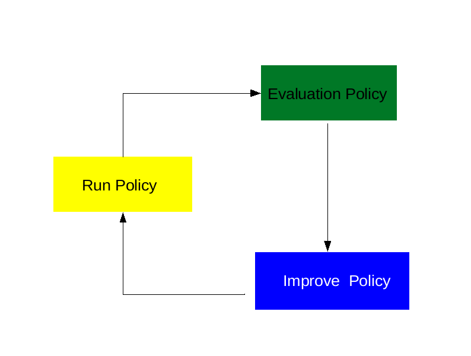

- [Overview](#overview)
- [Programming Philosophy](#programming-philosophy)
- [Architecture](#architecture)
- [Visualization](#visualization)
- [Visible or Invisible](#visible-or-invisible)
- [Acceleration](#acceleration)
- [Who is the agent?](#who-is-the-agent)
- [On States](#on-states)
- [Algorithms used in this project](#algorithms-used-in-this-project)
        - [1.Value based](#1value-based)
            - [1.1 DQN](#11-dqn)
            - [1.2 Double DQN](#12-double-dqn)
        - [2. Policy gradient](#2-policy-gradient)
            - [2.1 REINFORCE](#21-reinforce)
            - [2.2 Actor-Critic](#22-actor-critic)

# Overview
Deep Reinforcement learning ,which is very different from supervisored 
learning and unsupervisored learning ,is a great methodolgy for machine
to minic the way how human to interact with the world and  eventually 
evolve to AI somehow. After decades of development, there have been
many workable alorithms,say, SARSA,Q-Learning,etc.. In particular ,
when deep networks come into play, some classic reinforcment learning 
algorithms suddenly find a new way to be able to make magic happen.
Alphago was belived to be marked as one of milestones in machine learning
history because the deep reinforcment learning behind showed the amazing 
power which was never expected for most of us. A machine defeated a 
human champion in GO game. It is really amazing!

To understand those reinforcement learning, I know openAI' Gym  has provided
a cool platform to test algorithms ,but I prefer one that is more customizable,
easier to control,and more fun to work with. Finally,I decided to build one.
I found the game from the blog post [Build an AI to play Dino Run](https://blog.paperspace.com/dino-run/) and re-work on it. My plan is to setup
a simple framework for people to easily try various RL algorithms. It may be 
a long jounery, but we have been on the way.  

# Programming Philosophy 
Python is a very flexible programing language and can be easilly used in a 
procedure-oriented way. In fact, procedure-oriented-design is what many 
machine learning algorithms are being flollowed. 

But I dislike it. After reading many guys' codes, I just feel not good. 
ML algortim is somehow complexy in itself, but if the code is not writen 
caerfully, it might be even a double nigthmare. To make life easier,I hope the code is at least readable in the first palce , and the algorithm efficiency could be traded off if have to. So I decided to follow Object-Oriented-Design as much as possible. From my experience,I believe OOD is mostly  consistent with the human intuition. In the last decades, we have seen that numerous great softwares of industry strength were designed and programmed with OO principle. If used properly,OO is a swiss knife without any doubt. 

# Architecture 
It is necessary to set up a general framework for reinforcement learning algorithms. Here is the basic workflow as illustrated in [the course of  Berkely CS294-112](http://rail.eecs.berkeley.edu/deeprlcourse/).  

. 

We try to follow it as tightly as possible.

# Visualization 
To monitor the training process and the visual the results , we take advantage of 
the tensorboard as the toolkit.More specifically, we adopt the code posted in [repo](https://github.com/yunjey/pytorch-tutorial/tree/master/tutorials/04-utils/tensorboard) 
where the log entry is wrapped accroding to tensorflow Summary format as to be read by 
tensorboard. 

To use the tensorboad, just type the command in a terminal as below:

*
*    tensorboad --logdir ./log  --port 8008 
*

A tensorboard server will be launched and you can visit the tensorflow web page from a 
browser just as promoted in the terminal

# Visible or Invisible
It was thought that the dino carton image in the screenshot is  redundant for the traning and 
the deep network won't get much informantion from it because the dino icon is almost identical 
among all of the screenshots. We take an experiment to hide the dino by setting the icon invisible.
The result shows our original thought is wrong. The deep network seems getting  a lot of info 
from the dino carton image. It is worth to try by yourself and see what may happen.

# Acceleration 
When replay the game with  a pretrained network that is fit  by different dino running speed,the
peformance will degrade badly. Different accelerations mean non-stationary random process?

# Who is the agent? 

# On States
1.Agents should construct their own state from their experience
2.Agent state is a function of the previous state and the new observertion 
(Refer to "Priciple of deep RL" ,David Silver )

In this Dino game, the working state is actually a clip that includs four 
consecutive frames , three preivous frames+one latest frame.(Refer to 
the paper "Human-level control through deep reinforcement learning" )

# Algorithms used in this project 

###  1.Value based

####  1.1 DQN  ####
####  1.2 Double DQN ####

Based on our experiments, it seems the Double DQN is not necessarily better than DQN. This maybe the expected observation in Dino game for there are only two values in action space and the over max is not that seriouis as in a large action space.

### 2. Policy gradient 

#### 2.1  REINFORCE  ####
REINFORCE (Monte-Carlo policy gradient) relies on an estimated return by Monte-Carlo methods using episode samples to update the policy parameter θ. REINFORCE works because the expectation of the sample gradient is equal to the actual gradient, that is, the sample gradient is a unbiased estimation of the actual gradient:
$$\nabla_\theta J(\theta)= \mathbb{E}_\pi[Q^\pi(s, a) \nabla_\theta \ln \pi_\theta(a \vert s)] = \mathbb{E}_\pi[G_t\nabla_\theta \ln \pi_\theta(a \vert s)]$$   

It is common to subtract a baseline from the $G_t$ to reduce the variance. We try the baseline as the value of the state: $\hat{V(s)}$ ,estimated with a founction approximator,say, a netrual network in our case    

The algorithm is listed as below:  

>**REINFORCE with Baseline(episodic)**  
> 
>> Input: a  differentiable policy parameterization $\pi(a \vert s,\theta)$  
   Input: a  differentiable state-value function parameterization $\hat{v}(s,w)$  
   Algorithm parameters: step sizes $\alpha^\theta >0,\alpha^w >0$  
   Initialize  policy parameter $\theta$ and stete-value weights $w$  
   Loop forever (for each episode):
>>>Generate an episode $S_0,A_0,R_1,S_1,A_1,R_2,...S_{T-1},A_{T-1},R_T$,following $\pi     (.\vert.,\theta)$  
   Loop for each step of the episode t=0,1,.....T-1:
>>>>$G\leftarrow\sum_{k=t+1}^T\gamma^{k-t-1}R_k$  
    $\delta\leftarrow G-\hat{v}(S_t,w)$  
    $w\leftarrow w+\alpha^w\gamma^t\delta\nabla\hat{v}(S_t,w)$  
    $\theta\leftarrow\theta+\alpha^\theta\gamma^t\delta\nabla\ln\pi(A_t|S_t,\theta)$     
    
  
   
    

#### 2.2 Actor-Critic ####

   

